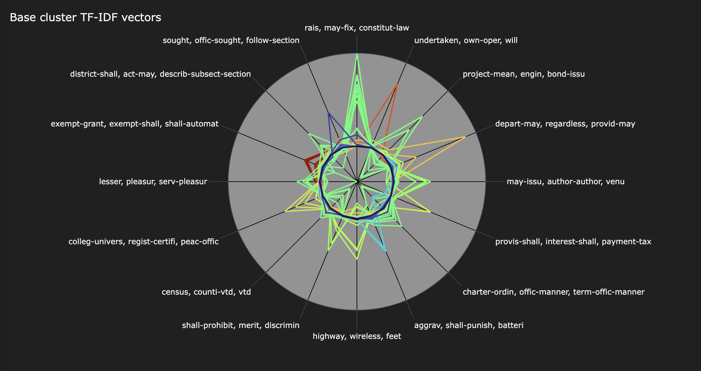
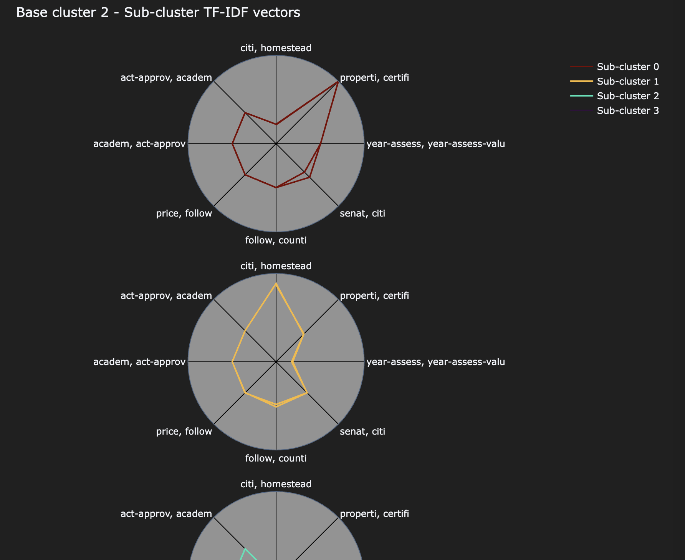
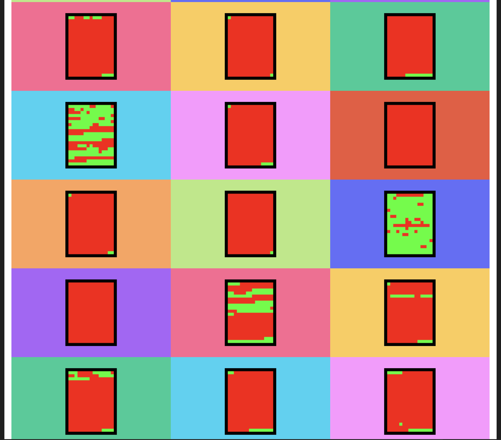
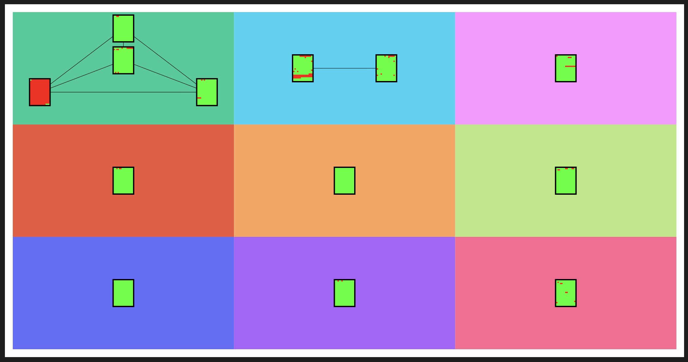

# eunomia
Document clustering, visualization, and analysis of American state-level legislation.

## What is Eunomia?  
This project was inspired by political advocacy groups which draft model legislation to promote their regulatory agendas. The generic bills these groups produce can be introduced across multiple states, often with only minor adjustments from the source text. It can be very difficult to fully assess the impact such groups actually have on the legislative regimes that Americans are subject to.

The goal of Eunomia is to help identify bills which can be traced back to a common source. Eunomia uses a combination of natural language processing (NLP) and clustering techniques to conduct forensic authorship, identifying the people responsible for creating and sponsoring model texts.

# The Data model
Eunomia uses two-tiered clustering to identify groups of bills by topic (first-order clusters), and then within each general topic, bills are analyzed for fine-grained textual similarity (second-order clusters).

This approach aims to minimize the computational expense of applying unsupervised models to a large number of documents. By filtering out common terms ("stopwords"), truncating ("stemming") vocabulary to shared roots, and limiting the number of terms used to produce tokenized n-grams, the first-order (topic) clusters paint with a relatively broad brush. This should capture the general vocabulary of the texts, establishing broad clusters across a given sample. 

Then, the first-order clusters can be re-assessed on a cluster-by-cluster basis, allowing more detailed lexical features to produce second-order clusters. By preserving text vocabularies as-is and using longer combinations of n-grams, texts in second-order clusters share a document "fingerprint" that may point to shared authorship.

## Visualizing & analyzing clusters
After featurizing and clustering documents in the sample, two forms of visualization are used to analyze clusters. For specific details of using the `eunomia.visualizer` package, see [the docs](<docs/02 - Clustering, visualization, and analysis.md>).

### PlotPolars
The `PlotPolars` class represents clusters as polar line plots. All documents in each cluster are represented based on the strength of a parameterized number of features. Optionally, you can display the top vocabulary terms associated with each feature. Clusters can be stacked on a single comprehensive plot or split into per-cluster subplots.

**First-order clusters, unified plot**


**Second-order clusters, separate subplots**


When visualizing second-order clusters, only the sub-clusters within a single base cluster can be visualized at a time.

### PlotDocs
The `PlotDocs` class represents the intersection of documents in a cluster. Each "document" image plotted shows roughly where segments of text align across all documents in a given cluster.

**First-order clusters**


**Second-order clusters**


For second-order clusters, the sub-clusters are shown as a collection within a particular base cluster.

## How does this differ from standard hierarchical clustering models?
Basic hierarchical clustering methods featurize the documents in a collection one time, and then use those features to build a comprehensive hierarchy of all available documents.

The standard hierarchical cluster analysis (HCA) methods are either bottom-up (agglomerative) or top-down (divisive). In bottom-up HCA, the two most similar documents would form the initial cluster, with the next-most-similar document then being added recursively until all documents form a single cluster. In the top-down approach, all documents start in a single cluster, which then gets recursively split into two or more clusters until a stopping metric is reached or all documents have been split into a "cluster" of n=1.

Eunomia is a hybrid model and not "true" hierarchical clustering, although it can be thought of as a pseudo-divisive approach. Although it produces first- and second-order clusters (aka, topic/base clusters and lexical/sub-clusters, respectively) similar to the hierarchical model, it uses different document features at each level. It also is not exhaustive - after the first pass is complete, unclustered documents are excluded from further analysis.

The actual clustering approach used is density-based, via cosine similarity of the document vectors. By default, Eunomia uses the `DBSCAN` algorithm from `scikit-learn`, although it is also set up to use `HDBSCAN` and `OPTICS`. It can optionally accept other clustering models provided as an input parameter.

# How to install
After cloning the repository, the `eunomia` package can be installed via pip:
```
pip install <eunomia folder location>
```

## Example runbooks and analysis
The pages in the [docs](docs) folder walk step by step through the details of the pipeline, with example usage and potential customizations.

# Why "Eunomia"?

<a href="https://en.wikipedia.org/wiki/Eunomia">Eunomia</a> was a minor Greek deity dedicated to good laws and good governance. May she look favorably upon this work.
<div style="clear: both;"></div>