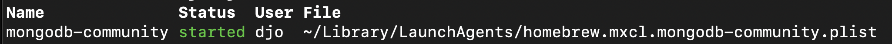

# Data wrangling

The primary data source used in these examples was a bulk download of several zip files from [LegiScan](https://legiscan.com/). For users who wish to compile their own dataset of bills from LegiScan, `eunomia.legiscanner` (based on [`pylegiscan`](https://github.com/poliquin/pylegiscan) by Chris Poliquin) is included in the library to make scraping relatively simple.

## Data summary
After loading data into MongoDB using the steps below, my total collection includes 1,165,008 bills from across all 50 states, not including DC. Importantly, the bills are unevenly distributed - this is to be expected,as some states have year-round legislatures while others only meet for sessions lasting up to a few weeks at a time. Some state legislatures only convene every 2 years. Here's the breakdown of my corpus's bill counts by state:  
```
AK :   4,431 (0.31%)  
AL :  14,698 (1.04%)  
AR :  13,878 (0.98%)  
AZ :  17,293 (1.22%)  
CA :  31,904 (2.26%)  
CO :   8,269 (0.59%)  
CT :  26,184 (1.85%)  
DE :   4,877 (0.35%)  
FL :  31,294 (2.22%)  
GA :  12,739 (0.90%)  
HI :  53,620 (3.80%)  
IA :  13,048 (0.92%)  
ID :   7,252 (0.51%)  
IL :  70,528 (5.00%)  
IN :  13,200 (0.93%)  
KS :   7,628 (0.54%)  
KY :  10,838 (0.77%)  
LA :  18,837 (1.33%)  
MA :  51,105 (3.62%)  
MD :  34,067 (2.41%)  
ME :  11,618 (0.82%)  
MI :  24,945 (1.77%)  
MN :  51,536 (3.65%)  
MO :  24,076 (1.71%)  
MS :  36,161 (2.56%)  
MT :   6,506 (0.46%)  
NC :  13,075 (0.93%)  
ND :   4,226 (0.30%)  
NE :   7,495 (0.53%)  
NH :  11,190 (0.79%)  
NJ :  57,556 (4.08%)  
NM :  12,126 (0.86%)  
NV :   6,368 (0.45%)  
NY : 124,330 (8.81%)  
OH :   7,284 (0.52%)  
OK :  46,094 (3.26%)  
OR :  17,350 (1.23%)  
PA :  27,924 (1.98%)  
RI :  24,053 (1.70%)  
SC :  11,176 (0.79%)  
SD :   6,111 (0.43%)  
TN :  43,762 (3.10%)  
TX :  32,790 (2.32%)  
UT :  10,057 (0.71%)  
VA :  28,804 (2.04%)  
VT :   7,508 (0.53%)  
WA :  24,072 (1.71%)  
WI :  12,858 (0.91%)  
WV :  23,677 (1.68%)  
WY :   4,590 (0.33%)  
```

In this walkthrough, we'll use a sample of bills from Georgia (2017-2020), but when building multi-state samples, the number of bills will be roughly proportional to the values above. So, for example, if creating a sample of bills from Oregon (17,350 bills) and Oklahoma (46,094 bills), with a sample size of 10%, there would be 1,735 Oregon bills and 4,609 Oklahoma bills in the final results. 

If applying additional filters to the sample, such as limiting by year, the number of bills from each state would be based on the total number of bills satisfying the filters, proportional by state.

# Prerequisites
After installing the `eunomia` package, you will need to make sure you have [MongoDB](https://www.mongodb.com/) installed and running. 

Note: These instructions are based on [MongoDB Community Edition v8.2.2](https://www.mongodb.com/docs/manual/administration/install-community/) running on MacOS, so some of the instructions that follow may need to be modified for Windows/Linux users.

If your setup is similar to mine, you can confirm the service is active by typing `brew services` in your terminal:



Additionally, I would strongly recommend configuring Tika for offline mode - otherwise it attempts to connect to the Apache servers when processing documents, which can slow things down significantly. You'll first need to download a couple files - for details on this, refer to  [Tika's documentation](https://pypi.org/project/tika/) (specifically, the section "Airgap Environment Setup"). Once you've downloaded the required files, add this code snippet to the initialization of your script:
```python
import os
os.environ['TIKA_SERVER_JAR'] = "file:////tika_folder/tika-server-standard-3.1.0.jar"
```
You'll need to edit the actual path here, depending on your setup.

# Loading documents into MongoDB
For users who are scraping their own sample from LegiScan via the API, the below steps will need to be modified based on any local files you've saved. If you're using `eunomia.legiscanner` to scrape data via the API, it automatically saves the queried results as a `pandas DataFrame`, which you can load directly to MongoDB via the `Legiscan2Mongo.load_df()` method instead of using `.load_zips()` as demonstrated here.

The `Legiscan2Mongo` class handles loading and organizing data, creating the MongoDB collection, and decoding document texts.

```python
# Create a Legiscan2Mongo object
from eunomia.legimongo import Legiscan2Mongo

loader = Legiscan2Mongo(
    load_dir = load_folder, # Path to folder with the zips
    mongo_db = 'example_db', # Database to use in MongoDB
    mongo_coll = 'example_collection' # Collection to use in MongoDB
    )
```
Optionally, the `Legiscan2Mongo` class can be initialized with the `verbose = True` parameter to print additional status messages as each file is being processed. Summaries of the processing results are returned on completion - these can be allowed to pass directly to stdout, stored and printed, or (my preference) logged.

I am a fan of logging as a best practice. Although the details are not covered here, feel free to use my [logging utility](https://github.com/davidjayowens/djo/blob/main/src/djo/io.py).
```python
from djo.io import Log

log = Log(id = 'eunomia', 
          file_name = f'Eunomia data loading - Processing {state}',
          file_dir = 'log_folder',
          level = 'DEBUG',
          verbose = True)
```

Now we begin actually extracting files and processing bills:
```python
log.log(f"Loading data from zips in folder: {load_folder}")

load_result = loader.load_zips(bill_types=1)
log.log(load_result)
```

I batch processed my input files state by state; here is an example from processing Wyoming:
```
INFO >> Loading data from zips in folder: /Volumes/Eunomia/LegiScan/WY
Zipfiles: 100.000% done // Bills in zip: 100.000% done

INFO >> RESULTS:
15 zip files found in target directory: /Volumes/Eunomia/LegiScan/WY
5176 bills were processed out of 5176 identified
5176 records were successfully inserted into Mongo (100.000% success rate)
-------------------------------------------------------
Mongo database: eunomia
Mongo collection: prod1
-------------------------------------------------------
For more details, review: (self).loading_fails
```

## Filtering by `bill_type`
There are many `bill_type` values in the LegiScan database, and most of them are not actual legislation. Some examples include:
* 1: 'Bill'
* 2: 'Resolution'
* 3: 'Concurrent Resolution'
* 4: 'Joint Resolution'
* 5: 'Joint Resolution Constitutional Amendment'
* 6: 'Executive Order'
* 7: 'Constitutional Amendment'
* 17: 'Initiative'
* 18: 'Petition'
* 19: 'Study Bill'
* 20: 'Initiative Petition'
* 21: 'Repeal Bill'
* 22: 'Remonstration'
* 23: 'Committee Bill'

To give you a sense of why I limit to only documents with `bill_type` of `1`, out of ~1.4 million documents in my collection, ~1.2 million of them are Bills. Further, many of the documents with other `bill_type` values are procedural or ceremonial, such as declarations honoring local businesses and organizations. They also do not generally correspond to most model bill texts.

# Data schema
Each record created in MongoDB uses the following schema:
```
MongoDB label : LegiScan identifier (data type)

_id : bill_id (int)
bill_id : bill_id (int)
bill_type_id : bill_type_id (str)

state : state (str)
session_id : session.session_id (int)
session_yr_start : session.year_start (int)
session_yr_end : session.year_end (int)
session_special : session.special (int)

sponsor_ids : sponsors.people_id (list[int])
sponsor_parties: sponsors.party_id (list[int])

title : title (str)
description : description (str)
doc_id : texts.doc_id (int)
doc_mime_id : texts.mime_id (int)
text_body_encoded : intro_text_body (str)
text_body : None (created during decode step)
```

For detailed descriptions of LegiScan identifiers and what their values mean, please refer to their [API documentation](https://legiscan.com/documentation/legiscan).


# Decoding bill texts
Once the raw documents are stored in your MongoDB collection, the actual document texts will need to be extracted from the base64 encoded strings. [Base64](https://en.wikipedia.org/wiki/Base64) is used here to enable documents to be transmitted as text strings via the API.

For the purposes of this project, I only include the first-available version of a bill's text, on the assumption that this will likely be the version most similar to a model bill. Thus this analysis only considers as-introduced bills and does not consider a bill's final text or even if the bill was adopted, although this could be a potential direction for future work.

Bill texts in the LegiScan database come in a variety of formats, and as a result, `eunomia.legimongo` has a relatively high number of dependencies, covered below.

| LegiScan mime_id | Document format |
| :-: | --- |
| 1 | HTML |
| 2 | PDF |
| 4 | MS Word |
| 5 | RTF |

`Legiscan2Mongo` uses a combination of methods to convert the base64 strings into plain text. `decode_texts()` manages the general text extraction pipeline for all bills in the current collection, and it relies primarily on two subordinate functions to handle the heavy lifting:
- `extract_text(text, mime_id)` extracts document texts from the base64 format LegiScan provides.
    - For HTML files, a combination of [`BeautifulSoup`](https://beautiful-soup-4.readthedocs.io/en/latest/#) and regex (via `re`) are used.
    - For PDF and MS Word, [`tika-python`](https://pypi.org/project/tika/) is used - see [Prerequisites](#prerequisites) above for additional details on installation and setup requirements.
    - For RTF documents, [`striprtf`](https://pypi.org/project/striprtf/).`rtf_to_text()` is used.
    - An internal `_flatten(text)` method is called on the extracted text to remove excess whitespace as well as any newline characters, so the final result is all a single "line" of text.
- `normalize_text(text)` applies [Normalization Form Compatibility Decomposition ("NFKD")](https://www.unicode.org/reports/tr15/) to the output of `extract_text()`.
    - This process facilitates text matching by reducing texts to a more limited set of characters. For example: 𝙰, 𝘼, 𝘈, 𝖠, 𝔸, 𝓐, 𝒜, 𝑨, 𝐴, 𝐀, Ａ, and Ⓐ, which are all distinct unicode characters, would all be converted to the basic ascii A.
    - NFKD removes some character decorators, and it converts ligated characters into their individual components, in addition to the character simplification example above. [Here is a helpful chart](https://www.unicode.org/charts/normalization/) of all character conversions, for reference (see column "KD").

For the user, text decoding is as simple as:
```python
decode_result = loader.decode_texts()

log.log(decode_result)
```
By default, this will attempt to decode all texts that have not already been processed in the collection. To limit processing to a single state, or to force re-processing of texts that have already been decoded, this method can be parameterized:
```python
decode_result = loader.decode_texts(state = 'GA',
                                    undecoded_only = False)
```

Here is an example of what the output looks like when complete:
```
Bills processed: 100.000% done // Decoded: 100.000% successful                
INFO >> RESULTS:
5176 bills were processed out of 5176 in current collection
5176 texts were successfully decoded and updated in Mongo (100.000% success rate)
-------------------------------------------------------
Mongo database: eunomia
Mongo collection: prod1
-------------------------------------------------------
For more details, review: (self).decoding_fails
```

# Review and save processing failures
Some bills may not be able to be loaded, decoded, or inserted into Mongo. `Legiscan2Mongo` tracks all of these for your QC, and it includes methods for saving this information for later review.

By default, MongoDB has a limit on the maximum document size it is able to store - decoded texts that exceed this limit will fail to be inserted into the collection. Since text clustering is already a memory-intensive endeavor, I opted to leave this limitation in place, so very large documents were excluded from my final dataset.

Overall, less than 1% of all available texts failed to reach the end of this pipeline, which I felt quite comfortable with.

## Loading failures
To review bills that simply could not be extracted from the original zip files, you can call:
```python
loader.loading_fails
```
This returns a list of tuples, each one containing: 
```
zip file, 
bill file, 
processing step when failure was encountered, 
actual error message
```
For example:
```
AK/AK_2009-2010_26th_Legislature_[58].zip, 
AK/2009-2010_26th_Legislature_[58]/bill/133228.json, 
Identifying first available bill document, 
list index out of range
```
This information can be saved as a csv using:
```python
loader.save_loading_fails(file_name='file/path/filename.csv')
```

## Decoding failures
Similarly, to review bills that either could not be decoded or could not be stored in Mongo, you can call:
```python
loader.decoding_fails
```
This returns a similar list of tuples, each containing:
```
bill_id,
mime_id,
actual error message
```
For example:
```
96497,
2,
expected string or bytes-like object, got 'NoneType'
```
This information can be saved as a csv using:
```python
loader.save_decoding_fails(file_name='file/path/filename.csv')
```

## Drop unprocessed/incomplete records
In order to clean up my final collection, I removed texts that either could not be successfully decoded or could not be stored in MongoDB.
(3874)


loader.MONGO.delete_many({'text_body':None})

