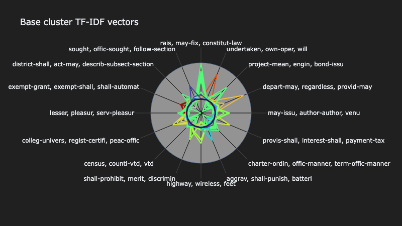
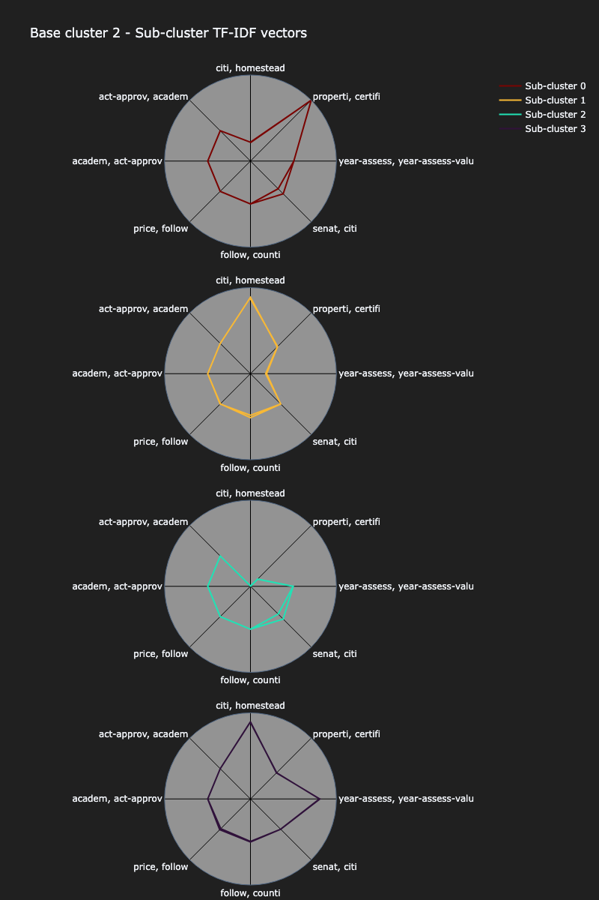
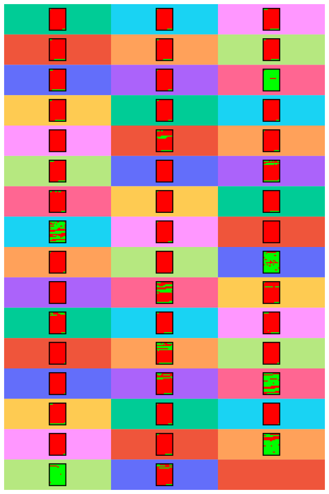
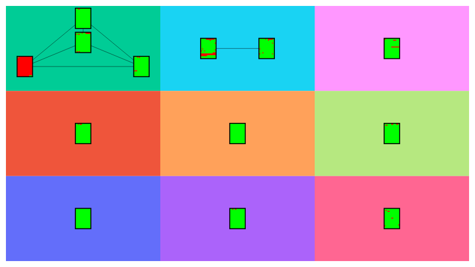

# Bill analysis
Once the corpus of bills has been decoded and loaded into MongoDB, the texts can be used analyzed using the `clustering` and `visualizer` packages. 

For details on creating the dataset, see [part one](<01 - Loading data and decoding texts.md>) of the walkthrough.

# Loading documents from MongoDB
The `eunomia.legimongo` package contains classes for interfacing with MongoDB. In part one we used `Legiscan2Mongo` to decode texts and load them into Mongo, but here we'll use `MongoDF` to load those documents from Mongo into a `pandas.DataFrame`, which will be used for clustering and visualization.

(In fact, under the hood, `Legiscan2Mongo` uses `MongoDF` for loading data to/from MongoDB.)

```python
from eunomia.legimongo import MongoDF
from eunomia.clustering import DocCluster
from eunomia.visualizer import PlotPolars, PlotDocs

# Data from MongoDB
sample = MongoDF(mongo_db='example_db', 
                 mongo_coll='example_collection')
```

# Clustering
The `MongoDF` class uses `.make_cluster_df()` to produce a `DataFrame` with only two features: an identifier ('bill_id') and the document texts ('text_body').

In this example, we'll use the `DBSCAN` clustering algorithm. The `cluster_method` parameter can be used to select `DBSCAN`, `HDBSCAN`, or `OPTICS` from the `scikit-learn` library; it can also accept an arbitrary clustering object, although it must have the `scikit-learn` standard `.fit()` method and `.labels_` attribute.

```python
# Make clustering object
clustr = DocCluster(sample.make_cluster_df(), 
                    text_col='text_body', 
                    verbose=True)

# First-order clusters
min_df = 3.0 / clustr.df.shape[0]   # Terms must exist in at least 3 documents
max_df = 0.03   # Terms can exist in at most 3% of all documents

clustr.make_base_clusters(min_df = min_df,
                          max_df = max_df,
                          tfidf_norm = 'max')
```

When using the `.make_sub_clusters()` method, the `level` parameter defines what level sub-clusters are assigned to, and `use_level` defines which level is used as the basis clusters. So, it is possible to make multiple sub-clusters from the same base level, or even sub-sub-clusters if desired.

```python
# Second-order clusters
clustr.make_sub_clusters(level = 2,
                         use_level = 1,
                         filter_bow = False,
                         stem_bow = False,
                         min_df = 0.05,
                         max_df = 1.0,
                         tfidf_norm = False)
```

Cluster attributes are stored as features of the attribute `DocDF.df`, so to view the raw data you can call, eg, `cluster.df.head()`.

To get a simplified list of the clusters that were created and their counts, use `clustr.get_clusters()` for all first-order clusters, or `cluster.get_clusters(base_level=1, sub_level=2)` to view second-order clusters.


# Visualizations
Once documents are clustered, we can begin to visualize them for analysis. The `DocCluster` object has convenient methods for producing subsets of the clustering data that align with the defaults used by `eunomia.visualizer` methods. Specifically, `.make_polar_df()` and `.make_doc_df()`, as demonstrated below.

It's also possible to visualize data that was clustered by other methods by overriding some of the parameter defaults.

Some plot customizations are demonstrated below, but these examples are not exhaustive. For documentation on all available parameters, check method docstrings.

## Visualize cluster TF-IDF vectors
To visualize and compare the TF-IDF vectors that represent each document, use the `PlotPolars` class. The `max_feats` parameter sets the upper limit on how many features the vectors will be reduced to (via `PCA`), although the actual number of features may be less than this value, depending on the number of documents present in the cluster.

```python
# Make polar plotting object
base_polar_plottr = PlotPolars(df=clustr.make_polar_df(), 
                               max_feats=16)

base_polar_plottr.plot( 
                    width = 800,
                    horizontal_spacing = 0.2,
                    vertical_spacing = 0.2,
                    margin = {'l':300,'r':300,'t':100,'b':100},
                    paper_bgcolor = "#202020",
                    plot_bgcolor = "#939393",
                    grid_color = 'black',
                    title = "Base cluster TF-IDF vectors",
                    showlegend = False,
                    ticklabel_nterms = 3,
                    ticklabel_radius = 30
                )
```



```python
# Visualize one specific sub-cluster
sub_viz_df = clustr.make_polar_df(base_level=1, 
                                  base_cluster=2, 
                                  sub_level=2)

sub_polar_plottr = PlotPolars(df=sub_viz_df, 
                              cluster_col='lvl2_cluster',
                              tfidf_col='lvl2_tfidf')

sub_polar_plottr.plot(
                    subplots = True,
                    max_subplot_cols = 1,
                    labels_like = 'Sub-cluster {id}',
                    width = 900,
                    height = 1200,
                    horizontal_spacing = 0.0,
                    vertical_spacing = 0.05,
                    margin = {'l':20,'r':20,'t':100,'b':20},
                    paper_bgcolor = "#202020",
                    plot_bgcolor = "#939393",
                    grid_color = 'black',
                    title = "Base cluster 2 - Sub-cluster TF-IDF vectors",
                    showlegend = True,
                    ticklabel_nterms = 2
                )
```


## Visualize cluster documents
To visualize and compare the document texts within each cluster,  use the `PlotDocs` class. Each cluster is represented as a single "page" (rectangle) of red/green pixels, where green represents a portion of text that exists in that position across all documents across the cluster, and red represents textual difference.

```python
# Make document plotting object
base_doc_plottr = PlotDocs(df=clustr.make_doc_df())

base_doc_plottr.plot(plot_range = 1,
                     width=800,
                     height=1200)
```



When visualizing sub-clusters, they are shown grouped by basis cluster. Documents that do not belong to any sub-cluster (eg, sub-cluster ID is -1) are excluded in this representation, although they are included when representing base clusters.
```python
# Visualize all available sub-clusters
sub_doc_df = clustr.make_doc_df(sub_level=2)

sub_doc_plottr = PlotDocs(df=sub_doc_df,
                          base_cluster_col='lvl1_cluster',
                          sub_cluster_col='lvl2_cluster')

sub_doc_plottr.plot(width=800)
```
